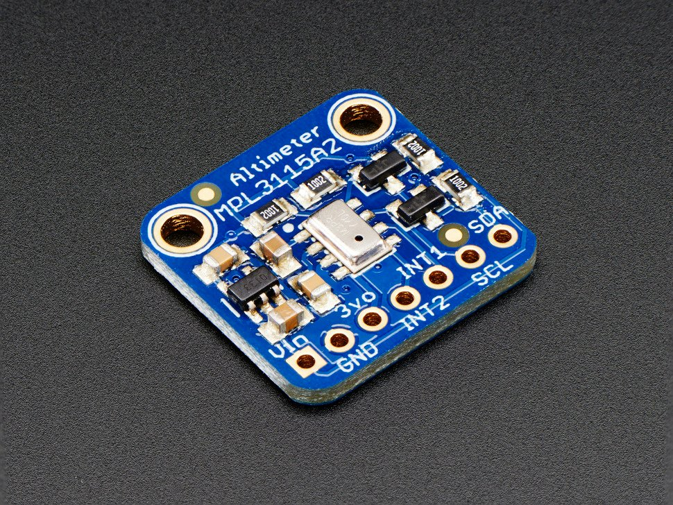
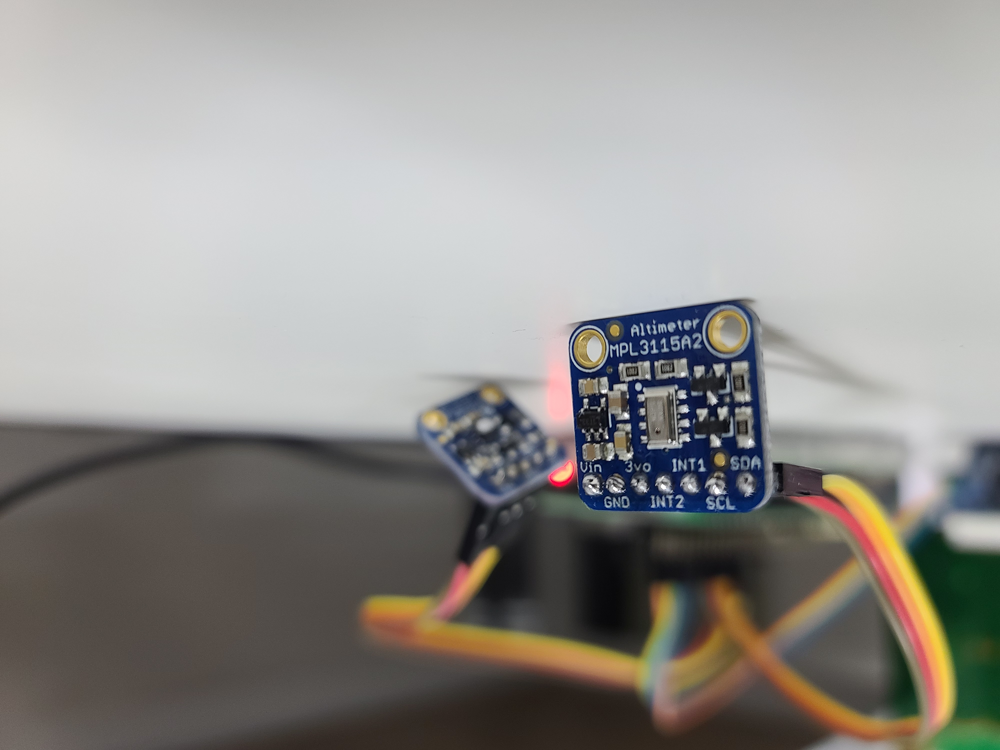
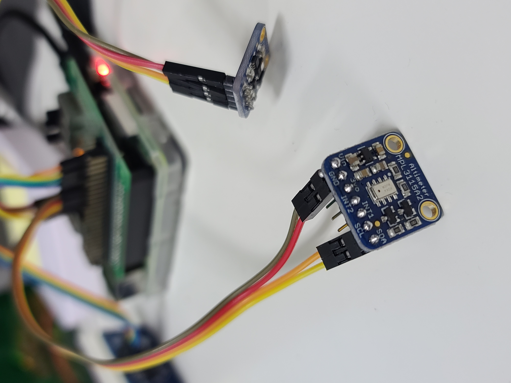

### Run example

```bash
$ python hello.py 
Note 101.3 kPa = 1 atm.

Pressure : 101.34 kPa
Temperature in Celsius : 25.50 C
Temperature in Fahrenheit : 77.90 F
```
### Tested 부품
* Adafruit 센서 : <br/>
MPL3115A2 - I2C Barometric Pressure/Altitude/Temperature Sensor <br/>
https://www.adafruit.com/product/1893








### TODO
* Add a datasheet

### References
https://www.instructables.com/Raspberry-Pi-MPL3115A2-Precision-Altimeter-Sensor--1/
