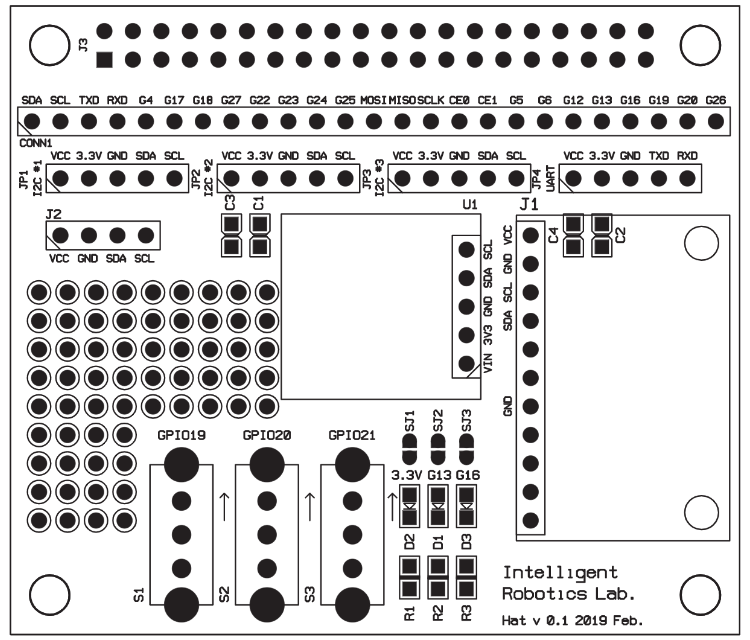

# RaspberryPi

### Example


### Numbering
* Difference between BOARD and BCM for GPIO pin numbering 
```
https://raspberrypi.stackexchange.com/a/12967
```

### Setting up 

* wiringPI
```
http://wiringpi.com/download-and-install/
```
```
NOTE: To compile programs with wiringPi, you need to add:
    -lwiringPi
```

*  RPi.GPIO 
아래와 같은 에러가 발생시 (python)
```bash
ModuleNotFoundError: No module named 'RPi'
```

아래처럼 확인 (각자의 virtual enviroment 활용)
```bash
pip freeze | grep RPi
```

없다면, 아래처럼
```bash
~/.venv/dev/bin/python3 -m pip install RPi.GPIO
```
* board
```bash
/.venv/dev/bin/python3 -m pip install adafruit-blinka
```

* Adafruit - htu21d
```bash
~/.venv/dev/bin/python3 -m pip install adafruit-circuitpython-htu21d
```


### Scanning an I2C bus for devices
```
i2cdetect -y 1
```

### Installing Adafruit_Python_LED_Backpack library
```bash
git clone https://github.com/adafruit/Adafruit_Python_LED_Backpack.git
cd Adafruit_Python_LED_Backpack
sudo python setup.py install
```
### PI3 GPIO


### Custom hat Ver. 0.1



### Devices tested

```bash
     0  1  2  3  4  5  6  7  8  9  a  b  c  d  e  f
00:          -- -- -- -- -- -- -- -- -- -- -- -- --
10: -- -- -- -- -- -- -- -- -- -- -- -- -- -- -- --
20: -- -- -- -- -- -- -- -- -- -- -- -- -- -- -- --
30: -- -- -- -- -- -- -- -- -- -- -- -- -- -- -- --
40: 40 -- -- -- -- -- -- -- -- -- -- -- -- -- -- --
50: -- -- -- -- -- -- -- -- -- -- -- -- -- -- -- --
60: 60 -- -- -- -- -- -- -- -- -- -- -- -- -- -- --
70: -- 71 -- -- -- -- -- --
```

#### 0x71 : Adafruit LED Backpacks
The HT16K33 driver chip on these LED backpacks has a default I2C address of 0x70.<br/> 
Since each device on an I2C bus must have a unique address, its important to avoid collisions or you'll get a lot of strange responses from your electronic devices! 
* https://learn.adafruit.com/adafruit-led-backpack
* https://learn.adafruit.com/adafruit-led-backpack/changing-i2c-address

#### 0x60 : MPL3115A2 
I2C Barometric Pressure/Altitude/Temperature Sensor

https://www.adafruit.com/product/1893


