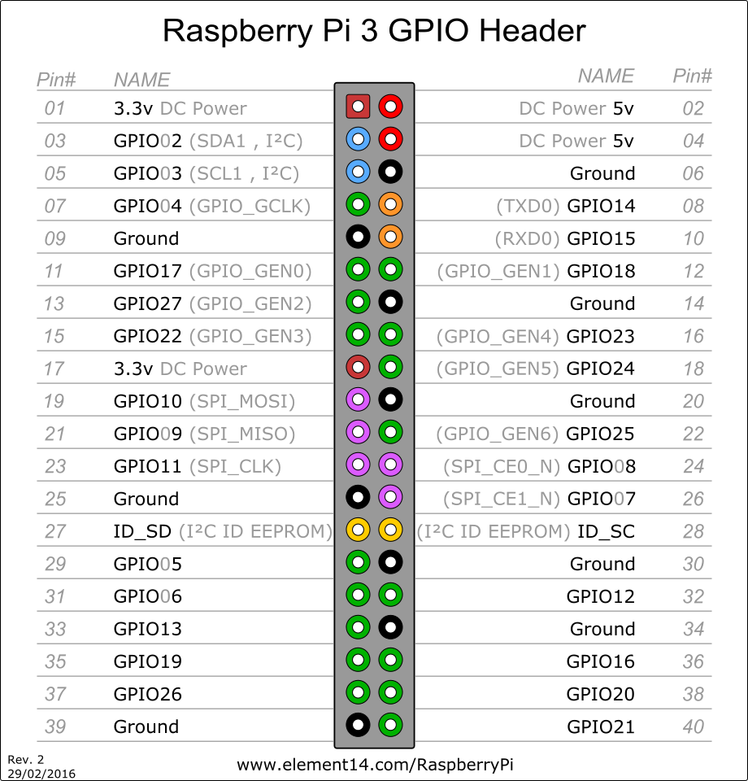

# RaspberryPi

### Setting up the wiringPI
http://wiringpi.com/download-and-install/

###
```
NOTE: To compile programs with wiringPi, you need to add:
    -lwiringPi
```

### Scanning an I2C bus for devices
```
i2cdetect -y 1
```

### Installing Adafruit_Python_LED_Backpack library
```
git clone https://github.com/adafruit/Adafruit_Python_LED_Backpack.git
cd Adafruit_Python_LED_Backpack
sudo python setup.py install
```
### PI3 GPIO

